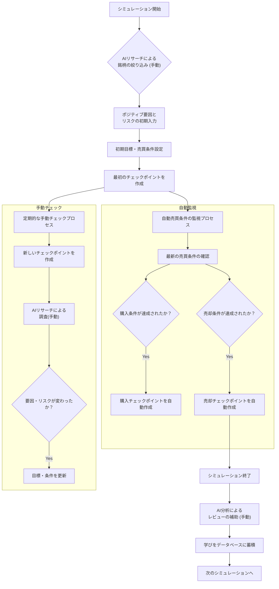

```mermaid
graph TD
    A[シミュレーション開始] --> B{"AIリサーチによる<br>銘柄の絞り込み (手動)"}
    B --> C[ポジティブ要因と<br>リスクの初期入力]
    C --> D[初期目標・売買条件設定]
    D --> E[最初のチェックポイントを作成]

    E --> F[定期的な手動チェックプロセス]
    E --> G[自動売買条件の監視プロセス]

    subgraph 手動チェック
        F --> E2[新しいチェックポイントを作成]
        E2 --> E3["AIリサーチによる<br>調査(手動)"]
        E3 --> H{"要因・リスクが変わったか？"}
        H -- "Yes" --> I[目標・条件を更新]
    end

    subgraph 自動監視
        G --> G1["最新の売買条件の確認"]
        G1 --> G2{"購入条件が達成されたか？"}
        G2 -- Yes --> G3[購入チェックポイントを自動作成]
        G1 --> G5{"売却条件が達成されたか？"}
        G5 -- Yes --> G6[売却チェックポイントを自動作成]
    end

    G6 --> K[シミュレーション終了]

    K --> L["AI分析による<br>レビューの補助 (手動)"]
    L --> M[学びをデータベースに蓄積]
    M --> N[次のシミュレーションへ]
```
