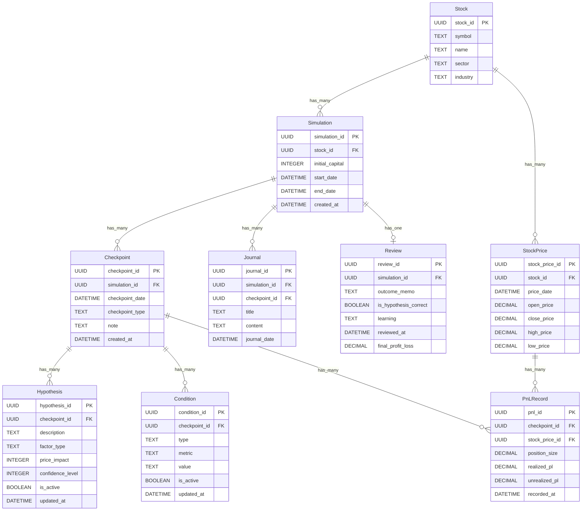

```mermaid
erDiagram
    Stock ||--o{ Simulation : has_many
    Stock ||--o{ StockPrice : has_many

    Simulation ||--o{ Checkpoint : has_many
    Simulation ||--o{ Journal : has_many
    Simulation ||--o| Review : has_one

    Checkpoint ||--o{ Hypothesis : has_many
    Checkpoint ||--o{ Condition : has_many
    Checkpoint ||--o{ PnLRecord : has_many

    StockPrice ||--o{ PnLRecord : has_many

    Stock {
        UUID stock_id PK
        TEXT symbol
        TEXT name
        TEXT sector
        TEXT industry
    }

    Simulation {
        UUID simulation_id PK
        UUID stock_id FK
        INTEGER initial_capital
        DATETIME start_date
        DATETIME end_date
        DATETIME created_at
    }

    Checkpoint {
        UUID checkpoint_id PK
        UUID simulation_id FK
        DATETIME checkpoint_date
        TEXT checkpoint_type
        TEXT note
        DATETIME created_at
    }

    Hypothesis {
        UUID hypothesis_id PK
        UUID checkpoint_id FK
        TEXT description
        TEXT factor_type
        INTEGER price_impact
        INTEGER confidence_level
        BOOLEAN is_active
        DATETIME updated_at
    }

    Condition {
        UUID condition_id PK
        UUID checkpoint_id FK
        TEXT type
        TEXT metric
        TEXT value
        BOOLEAN is_active
        DATETIME updated_at
    }

    PnLRecord {
        UUID pnl_id PK
        UUID checkpoint_id FK
        UUID stock_price_id FK
        DECIMAL position_size
        DECIMAL realized_pl
        DECIMAL unrealized_pl
        DATETIME recorded_at
    }

    Journal {
        UUID journal_id PK
        UUID simulation_id FK
        UUID checkpoint_id FK
        TEXT title
        TEXT content
        DATETIME journal_date
    }

    Review {
        UUID review_id PK
        UUID simulation_id FK
        TEXT outcome_memo
        BOOLEAN is_hypothesis_correct
        TEXT learning
        DATETIME reviewed_at
        DECIMAL final_profit_loss
    }

    StockPrice {
        UUID stock_price_id PK
        UUID stock_id FK
        DATETIME price_date
        DECIMAL open_price
        DECIMAL close_price
        DECIMAL high_price
        DECIMAL low_price
    }
```
