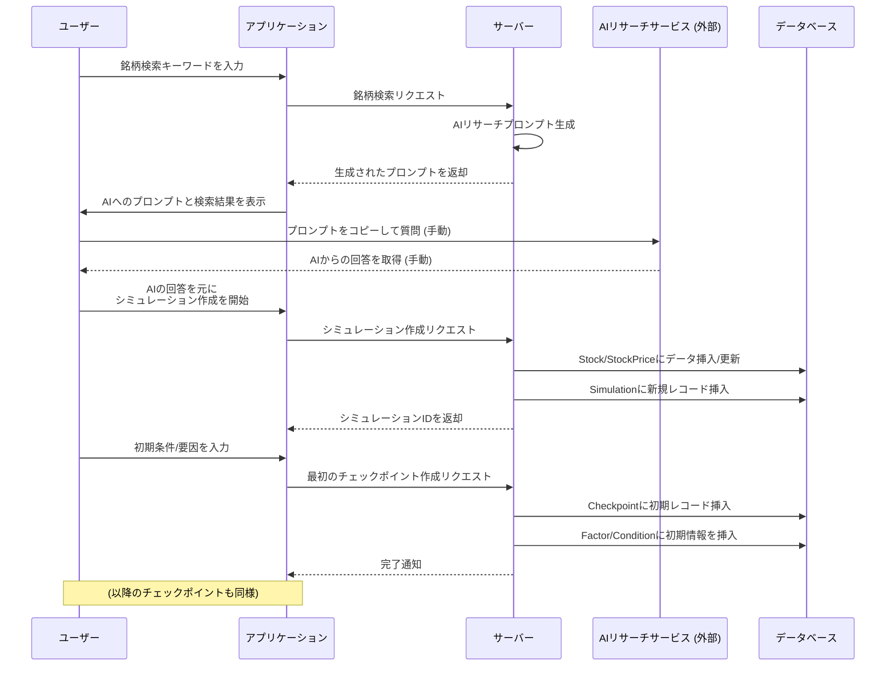

```mermaid
sequenceDiagram
    participant U as ユーザー
    participant App as アプリケーション
    participant Server as サーバー
    participant AI as AIリサーチサービス (外部)
    participant DB as データベース

    U->>App: 銘柄検索キーワードを入力
    App->>Server: 銘柄検索リクエスト
    Server->>Server: AIリサーチプロンプト生成
    Server-->>App: 生成されたプロンプトを返却
    App->>U: AIへのプロンプトと検索結果を表示

    U->>AI: プロンプトをコピーして質問 (手動)
    AI-->>U: AIからの回答を取得 (手動)

    U->>App: AIの回答を元に<br>シミュレーション作成を開始
    App->>Server: シミュレーション作成リクエスト
    Server->>DB: Stock/StockPriceにデータ挿入/更新
    Server->>DB: Simulationに新規レコード挿入
    Server-->>App: シミュレーションIDを返却

    U->>App: 初期条件/要因を入力
    App->>Server: 最初のチェックポイント作成リクエスト
    Server->>DB: Checkpointに初期レコード挿入
    Server->>DB: Factor/Conditionに初期情報を挿入
    Server-->>App: 完了通知

    Note over U,App: (以降のチェックポイントも同様)
```
